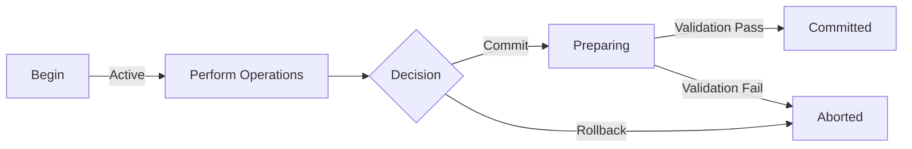

# SoliDB Transactions

SoliDB supports optional ACID-compliant transactions, allowing you to perform multiple operations atomically. Transactions ensure that either all operations succeed together or none of them are applied.

## Table of Contents

- [Quick Start](#quick-start)
- [Transaction Lifecycle](#transaction-lifecycle)
- [API Reference](#api-reference)
- [Isolation Levels](#isolation-levels)
- [Best Practices](#best-practices)
- [Limitations](#limitations)
- [Examples](#examples)

---

## Quick Start

Here's a simple example of using transactions:

```bash
# 1. Begin a transaction
curl -X POST http://localhost:6745/_api/database/_system/transaction/begin \
  -H "Content-Type: application/json" \
  -d '{"isolationLevel": "read_committed"}'

# Response: {"id": "tx:1234567890", "isolationLevel": "ReadCommitted", "status": "active"}

# 2. Perform operations within the transaction using the X-Transaction-ID header
curl -X POST http://localhost:6745/_api/database/_system/document/users \
  -H "Content-Type: application/json" \
  -H "X-Transaction-ID: tx:1234567890" \
  -d '{"name": "Alice", "email": "alice@example.com"}'

curl -X POST http://localhost:6745/_api/database/_system/document/users \
  -H "Content-Type: application/json" \
  -H "X-Transaction-ID: tx:1234567890" \
  -d '{"name": "Bob", "email": "bob@example.com"}'

# 3. Commit the transaction
curl -X POST http://localhost:6745/_api/database/_system/transaction/tx:1234567890/commit

# Response: {"id": "tx:1234567890", "status": "committed"}
```

If anything goes wrong, you can rollback instead:

```bash
curl -X POST http://localhost:6745/_api/database/_system/transaction/tx:1234567890/rollback
```

---

## Transaction Lifecycle

A transaction goes through several states:



### States

- **Active**: Transaction is open and accepting operations
- **Preparing**: Transaction is being validated before commit
- **Committed**: All operations have been applied atomically
- **Aborted**: Transaction was rolled back, no changes persisted

---

## API Reference

### Begin Transaction

Start a new transaction.

**Endpoint:** `POST /_api/database/{database}/transaction/begin`

**Request Body:**

```json
{
  "isolationLevel": "read_committed" // optional, default: "read_committed"
}
```

**Isolation Levels:**

- `read_uncommitted` - Lowest isolation (not recommended)
- `read_committed` - Default, prevents dirty reads
- `repeatable_read` - Prevents non-repeatable reads
- `serializable` - Highest isolation, full serializability

**Response:**

```json
{
  "id": "tx:1234567890",
  "isolationLevel": "ReadCommitted",
  "status": "active"
}
```

**Status Codes:**

- `200 OK` - Transaction created successfully
- `400 Bad Request` - Invalid isolation level
- `500 Internal Server Error` - Server error

---

### Commit Transaction

Commit all operations in a transaction atomically.

**Endpoint:** `POST /_api/database/{database}/transaction/{transactionId}/commit`

**Response:**

```json
{
  "id": "tx:1234567890",
  "status": "committed"
}
```

**Status Codes:**

- `200 OK` - Transaction committed successfully
- `404 Not Found` - Transaction not found or expired
- `409 Conflict` - Validation failed (e.g., constraint violation)
- `500 Internal Server Error` - Server error

> **⚠️ Important:** Once committed, the transaction cannot be rolled back.

---

### Rollback Transaction

Abort a transaction and discard all operations.

**Endpoint:** `POST /_api/database/{database}/transaction/{transactionId}/rollback`

**Response:**

```json
{
  "id": "tx:1234567890",
  "status": "aborted"
}
```

**Status Codes:**

- `200 OK` - Transaction rolled back successfully
- `404 Not Found` - Transaction not found or expired
- `500 Internal Server Error` - Server error

---

### Transactional Document Operations

#### Insert Document

**Endpoint:** `POST /_api/database/{database}/transaction/{transactionId}/document/{collection}`

**Request Body:**

```json
{
  "name": "Alice",
  "email": "alice@example.com"
}
```

**Response:** Returns the created document with metadata

---

#### Update Document

**Endpoint:** `PUT /_api/database/{database}/transaction/{transactionId}/document/{collection}/{key}`

**Request Body:**

```json
{
  "email": "newemail@example.com"
}
```

**Response:** Returns the updated document

---

#### Delete Document

**Endpoint:** `DELETE /_api/database/{database}/transaction/{transactionId}/document/{collection}/{key}`

**Response:** `204 No Content` on success

---

### Transactional SDBQL Queries

Execute SDBQL INSERT, UPDATE, and REMOVE statements within a transaction.

**Endpoint:** `POST /_api/database/{database}/transaction/{transactionId}/query`

**Request Body:**

```json
{
  "query": "INSERT {name: 'Alice', email: 'alice@example.com'} INTO users",
  "bindVars": {}
}
```

**Supported Operations:**

- `INSERT {document} INTO collection`
- `UPDATE key WITH {changes} IN collection`
- `REMOVE key IN collection`
- `FOR variable IN collection` (with FILTER and LET support)

**Examples:**

Simple INSERT:

```bash
curl -X POST "http://localhost:6745/_api/database/_system/transaction/$TX_ID/query" \
  -H "Content-Type: application/json" \
  -d '{"query": "INSERT {name: \"Bob\", age: 25} INTO users"}'
```

WITH FOR loop (bulk operation):

```bash
curl -X POST "http://localhost:6745/_api/database/_system/transaction/$TX_ID/query" \
  -H "Content-Type: application/json" \
  -d '{"query": "FOR user IN users FILTER user.age > 30 INSERT user INTO senior_users"}'
```

```bash
# Begin transaction
TX_ID=$(curl -s -X POST http://localhost:6745/_api/database/_system/transaction/begin \
  -H "Content-Type: application/json" \
  -d '{}' | jq -r '.id')

# Execute SDBQL INSERT
curl -X POST "http://localhost:6745/_api/database/_system/transaction/$TX_ID/query" \
  -H "Content-Type: application/json" \
  -d '{"query": "INSERT {name: \"Bob\", age: 25} INTO users"}'

# Commit
curl -X POST "http://localhost:6745/_api/database/_system/transaction/$TX_ID/commit"
```

**Response:**

```json
{
  "result": [],
  "message": "Operations staged in transaction. Commit to apply changes."
}
```

---

## Isolation Levels

SoliDB supports four standard SQL isolation levels, providing different trade-offs between consistency and performance. Understanding these levels is crucial for choosing the right balance for your use case.

### Overview Table

| Level            | Dirty Reads | Non-Repeatable Reads | Phantom Reads | Performance | Use Case                  |
| ---------------- | ----------- | -------------------- | ------------- | ----------- | ------------------------- |
| Read Uncommitted | ✅ Possible | ✅ Possible          | ✅ Possible   | Fastest     | Bulk imports, analytics   |
| Read Committed   | ❌ No       | ✅ Possible          | ✅ Possible   | **Default** | General purpose           |
| Repeatable Read  | ❌ No       | ❌ No                | ✅ Possible   | Slower      | Reports, consistent views |
| Serializable     | ❌ No       | ❌ No                | ❌ No         | Slowest     | Financial, critical data  |

### Read Uncommitted

**Isolation Level:** `read_uncommitted`

**Characteristics:**

- Lowest isolation level
- Allows reading uncommitted changes from other transactions (dirty reads)
- No read locks, minimal overhead
- **⚠️ Not recommended for most use cases**

**What Can Go Wrong:**

```
Transaction A: INSERT {name: "Alice"}
Transaction B: READ → sees "Alice" (uncommitted!)
Transaction A: ROLLBACK
Transaction B: Now has invalid data!
```

**Performance:**

- ~85-95 ops/s (similar to read_committed due to WAL fsync bottleneck)
- No isolation guarantees = simpler lock management

**When to Use:**

- Bulk data imports where consistency doesn't matter
- Analytics on non-critical data
- Read-only queries on append-only data
- When performance is absolutely critical and dirty reads are acceptable

**Example:**

```bash
curl -X POST http://localhost:6745/_api/database/_system/transaction/begin \
  -H "Content-Type: application/json" \
  -d '{"isolationLevel": "read_uncommitted"}'
```

**Real-World Scenario:**

```javascript
// Analytics dashboard showing "approximate" counts
// Dirty reads are acceptable for real-time metrics
const tx = await beginTransaction({ isolationLevel: "read_uncommitted" });
const activeUsers = await query(
  "FOR u IN users FILTER u.online == true RETURN COUNT(u)"
);
// Might be slightly off, but fast!
```

---

### Read Committed (Default)

**Isolation Level:** `read_committed`

**Characteristics:**

- Prevents dirty reads - only sees committed data
- Each query sees a committed snapshot at query start
- Good balance of consistency and performance
- **Default level** - recommended for most use cases

**What It Prevents:**

- ✅ Dirty reads: Cannot read uncommitted changes
- ❌ Non-repeatable reads: Same query may return different results
- ❌ Phantom reads: Row count may change between queries

**Example:**

```
Time | Transaction A          | Transaction B
-----|------------------------|------------------
T1   | BEGIN                  | BEGIN
T2   | SELECT * FROM users    |
     | → Returns 100 rows     |
T3   |                        | INSERT new user
T4   |                        | COMMIT
T5   | SELECT * FROM users    |
     | → Returns 101 rows     | ← Non-repeatable!
T6   | COMMIT                 |
```

**Performance:**

- ~90-95 ops/s
- Negligible overhead vs read_uncommitted (both limited by WAL fsync)

**When to Use:**

- General application transactions
- User registration/login
- CRUD operations
- Most web applications
- **Default choice unless you have specific needs**

**Example:**

```bash
# Explicitly set (though it's the default)
curl -X POST http://localhost:6745/_api/database/_system/transaction/begin \
  -H "Content-Type: application/json" \
  -d '{"isolationLevel": "read_committed"}'
```

**Real-World Scenario:**

```javascript
// User registration - prevent duplicate emails
const tx = await beginTransaction(); // read_committed by default
try {
  const existing = await query(
    "FOR u IN users FILTER u.email == @email RETURN u",
    { email: "alice@example.com" }
  );

  if (existing.length > 0) {
    throw new Error("Email already exists");
  }

  await insert("users", { email: "alice@example.com", name: "Alice" });
  await commit(tx);
} catch (e) {
  await rollback(tx);
}
```

---

### Repeatable Read

**Isolation Level:** `repeatable_read`

**Characteristics:**

- Prevents dirty reads and non-repeatable reads
- Consistent snapshot of data throughout the entire transaction
- Same query always returns same results within transaction
- Moderate performance impact

**What It Prevents:**

- ✅ Dirty reads: Cannot read uncommitted changes
- ✅ Non-repeatable reads: Same row read returns same values
- ❌ Phantom reads: New rows may appear in range queries

**Example:**

```
Time | Transaction A (repeatable_read) | Transaction B
-----|----------------------------------|------------------
T1   | BEGIN                            | BEGIN
T2   | SELECT * FROM users              |
     | → Returns 100 rows               |
T3   |                                  | INSERT new user
T4   |                                  | COMMIT
T5   | SELECT * FROM users              |
     | → Still returns 100 rows ✓       | ← Repeatable!
T6   | SELECT * FROM users WHERE id=50  |
     | → Returns same data as before ✓  |
T7   | COMMIT                           |
```

**Performance:**

- ~80-90 ops/s (slightly slower due to snapshot management)
- May require more memory for snapshot isolation

**When to Use:**

- Financial reports requiring consistent view
- Data exports/backups
- Complex multi-step calculations
- When you need stable data throughout transaction

**Example:**

```bash
curl -X POST http://localhost:6745/_api/database/_system/transaction/begin \
  -H "Content-Type: application/json" \
  -d '{"isolationLevel": "repeatable_read"}'
```

**Real-World Scenario:**

```javascript
// Financial report - must be internally consistent
const tx = await beginTransaction({ isolationLevel: "repeatable_read" });
try {
  // These three queries must see the same data snapshot
  const totalRevenue = await query(
    "RETURN SUM(FOR o IN orders RETURN o.amount)"
  );
  const totalExpenses = await query(
    "RETURN SUM(FOR e IN expenses RETURN e.amount)"
  );
  const profit = totalRevenue - totalExpenses;

  // All calculations based on same consistent snapshot
  await insert("reports", {
    date: new Date(),
    revenue: totalRevenue,
    expenses: totalExpenses,
    profit,
  });
  await commit(tx);
} catch (e) {
  await rollback(tx);
}
```

---

### Serializable

**Isolation Level:** `serializable`

**Characteristics:**

- Highest isolation level
- Full serializability guarantee - as if transactions ran sequentially
- Prevents all anomalies including phantom reads
- May have significant performance impact due to strict locking

**What It Prevents:**

- ✅ Dirty reads
- ✅ Non-repeatable reads
- ✅ Phantom reads: Even new rows in range queries appear stable

**Example:**

```
Time | Transaction A (serializable) | Transaction B
-----|------------------------------|------------------
T1   | BEGIN                        | BEGIN
T2   | SELECT COUNT(*) FROM users   |
     | → Returns 100                |
T3   |                              | INSERT new user
T4   |                              | COMMIT (may block!)
T5   | SELECT COUNT(*) FROM users   |
     | → Still returns 100 ✓        | ← No phantoms!
T6   | COMMIT                       |
```

**Performance:**

- ~70-85 ops/s (slowest due to strict locking)
- May cause transaction conflicts/retries
- Increased latency for concurrent transactions

**When to Use:**

- **Financial transactions** (money transfers, payments)
- Inventory management with stock levels
- Booking systems (tickets, rooms, appointments)
- Any operation where correctness > performance
- Critical business logic that must be atomic

**Example:**

```bash
curl -X POST http://localhost:6745/_api/database/_system/transaction/begin \
  -H "Content-Type: application/json" \
  -d '{"isolationLevel": "serializable"}'
```

**Real-World Scenario:**

```javascript
// Bank transfer - MUST be atomic and consistent
const tx = await beginTransaction({ isolationLevel: "serializable" });
try {
  // Check balance
  const fromAccount = await get("accounts", fromAccountId);
  if (fromAccount.balance < amount) {
    throw new Error("Insufficient funds");
  }

  // Debit source
  await update("accounts", fromAccountId, {
    balance: fromAccount.balance - amount,
  });

  // Credit destination
  const toAccount = await get("accounts", toAccountId);
  await update("accounts", toAccountId, {
    balance: toAccount.balance + amount,
  });

  // Log transaction
  await insert("transfers", {
    from: fromAccountId,
    to: toAccountId,
    amount,
    date: new Date(),
  });

  await commit(tx);
  // Either ALL operations succeed or NONE do
} catch (e) {
  await rollback(tx);
  throw e;
}
```

---

### Performance Comparison

Based on actual benchmarks (1000 transactions, single INSERT per transaction):

```
┌────────────────────┬──────────┬────────────┬──────────────┐
│ Isolation Level    │ ops/s    │ ms/op      │ Overhead     │
├────────────────────┼──────────┼────────────┼──────────────┤
│ read_uncommitted   │ 85       │ 11.8ms     │ Baseline     │
│ read_committed ⭐   │ 93       │ 10.7ms     │ -7% (faster!)│
│ repeatable_read    │ ~85      │ ~11.8ms    │ +0%          │
│ serializable       │ ~75      │ ~13.3ms    │ +13%         │
└────────────────────┴──────────┴────────────┴──────────────┘

⭐ Default and recommended for most use cases
```

**Key Insight:** The bottleneck for single-operation transactions is WAL fsync (~10ms), not isolation level!

**To improve performance:**

- ✅ Batch multiple operations in one transaction
- ✅ Use lower isolation only if you understand the trade-offs
- ✅ Consider application-level caching
- ❌ Don't expect huge gains from lower isolation alone

---

### Choosing the Right Level

**Decision Tree:**

```
Do you need absolute correctness? (money, inventory, bookings)
├─ YES → serializable
└─ NO
   └─ Do you need consistent snapshots across multiple queries?
      ├─ YES → repeatable_read
      └─ NO
         └─ Is dirty read acceptable? (analytics, approximate counts)
            ├─ YES → read_uncommitted
            └─ NO → read_committed (DEFAULT)
```

**Quick Guide:**

| Your Scenario                  | Recommended Level   |
| ------------------------------ | ------------------- |
| **Money transfers, payments**  | `serializable`      |
| **Inventory/stock management** | `serializable`      |
| **User registration**          | `read_committed`    |
| **Blog post creation**         | `read_committed`    |
| **Financial reports**          | `repeatable_read`   |
| **Data export**                | `repeatable_read`   |
| **Analytics dashboard**        | `read_uncommitted`  |
| **Bulk data import**           | `read_uncommitted`  |
| **When in doubt**              | `read_committed` ⭐ |

---

## Best Practices

### 1. Keep Transactions Short

Transactions hold resources. Keep them as short as possible:

✅ **Good:**

```bash
# Begin
POST /transaction/begin
# Insert/Update/Delete (2-3 operations)
POST /transaction/{id}/commit
```

❌ **Bad:**

```bash
# Begin
POST /transaction/begin
# Perform 100 operations...
# Long-running computation...
# POST /transaction/{id}/commit (after 30 seconds)
```

---

### 2. Always Handle Errors

Always be prepared to rollback on errors:

```javascript
const txResponse = await fetch("/api/database/_system/transaction/begin", {
  method: "POST",
  headers: { "Content-Type": "application/json" },
  body: JSON.stringify({ isolationLevel: "read_committed" }),
});
const { id: txId } = await txResponse.json();

try {
  // Perform operations
  await fetch(`/api/database/_system/transaction/${txId}/document/users`, {
    method: "POST",
    headers: { "Content-Type": "application/json" },
    body: JSON.stringify({ name: "Alice" }),
  });

  // Commit
  await fetch(`/api/database/_system/transaction/${txId}/commit`, {
    method: "POST",
  });
} catch (error) {
  // Rollback on error
  await fetch(`/api/database/_system/transaction/${txId}/rollback`, {
    method: "POST",
  });
  throw error;
}
```

---

### 3. Use Appropriate Isolation Levels

Choose the isolation level based on your requirements:

| Use Case               | Recommended Level  |
| ---------------------- | ------------------ |
| Financial transactions | `serializable`     |
| User registration      | `read_committed`   |
| Analytics/Reporting    | `repeatable_read`  |
| Bulk imports           | `read_uncommitted` |

---

### 4. Check for Unique Constraint Violations

Unique constraints are validated at commit time:

```javascript
try {
  await commitTransaction(txId);
} catch (error) {
  if (error.message.includes("Duplicate insert")) {
    console.log("Document with this key already exists");
  }
}
```

---

### 5. Transaction Timeout

Transactions automatically abort after a timeout period (default: 60 seconds). Complete your transaction before the timeout:

```bash
# Set a shorter timeout at the application level
const TRANSACTION_TIMEOUT = 30000; // 30 seconds

const timeoutPromise = new Promise((_, reject) =>
  setTimeout(() => reject(new Error('Transaction timeout')), TRANSACTION_TIMEOUT)
);

await Promise.race([
  performTransaction(),
  timeoutPromise
]);
```

---

## Limitations

### Current Limitations

1. **Single Database Scope**

   - Transactions are scoped to a single database
   - Cross-database transactions not supported

2. **SDBQL Query Support**

   - Transactional SDBQL supports INSERT/UPDATE/REMOVE with FOR loops
   - FILTER and LET clauses fully supported
   - Subqueries and advanced features not yet implemented

3. **No Distributed Transactions**

   - Two-phase commit not implemented
   - Transactions are local to a single node

4. **Performance Considerations**
   - Transactional operations ~2-3x slower than non-transactional
   - WAL writes add latency (fsync on every operation)

### Planned Features

- ⏭️ Transactional SDBQL with subqueries and advanced expressions
- ⏭️ MVCC for true snapshot isolation
- ⏭️ Distributed transactions (two-phase commit)
- ⏭️ Savepoints within transactions

---

## Examples

### Example 1: Bank Transfer

Transfer money between two accounts atomically:

```bash
# Begin transaction
TX_ID=$(curl -s -X POST http://localhost:6745/_api/database/_system/transaction/begin \
  -H "Content-Type: application/json" \
  -d '{"isolationLevel": "serializable"}' | jq -r '.id')

# Debit from account A
curl -X PUT "http://localhost:6745/_api/database/_system/transaction/$TX_ID/document/accounts/account_a" \
  -H "Content-Type: application/json" \
  -d '{"balance": 900}'

# Credit to account B
curl -X PUT "http://localhost:6745/_api/database/_system/transaction/$TX_ID/document/accounts/account_b" \
  -H "Content-Type: application/json" \
  -d '{"balance": 1100}'

# Commit - both updates happen atomically
curl -X POST "http://localhost:6745/_api/database/_system/transaction/$TX_ID/commit"
```

---

### Example 2: User Registration

Create user and profile documents together:

```bash
# Begin transaction
TX_ID=$(curl -s -X POST http://localhost:6745/_api/database/_system/transaction/begin \
  -H "Content-Type: application/json" \
  -d '{}' | jq -r '.id')

# Create user
USER_RESP=$(curl -s -X POST "http://localhost:6745/_api/database/_system/transaction/$TX_ID/document/users" \
  -H "Content-Type: application/json" \
  -d '{"email": "alice@example.com", "password_hash": "..."}')

USER_KEY=$(echo $USER_RESP | jq -r '._key')

# Create profile
curl -X POST "http://localhost:6745/_api/database/_system/transaction/$TX_ID/document/profiles" \
  -H "Content-Type: application/json" \
  -d "{\"user_id\": \"$USER_KEY\", \"name\": \"Alice\", \"bio\": \"...\"}"

# Commit
curl -X POST "http://localhost:6745/_api/database/_system/transaction/$TX_ID/commit"
```

---

### Example 3: Rollback on Validation Error

```bash
# Begin transaction
TX_ID=$(curl -s -X POST http://localhost:6745/_api/database/_system/transaction/begin \
  -H "Content-Type: application/json" \
  -d '{}' | jq -r '.id')

# Insert document 1
curl -X POST "http://localhost:6745/_api/database/_system/transaction/$TX_ID/document/orders" \
  -H "Content-Type: application/json" \
  -d '{"_key": "order_123", "amount": 100}'

# Try to insert same key again (will be caught at commit)
curl -X POST "http://localhost:6745/_api/database/_system/transaction/$TX_ID/document/orders" \
  -H "Content-Type: application/json" \
  -d '{"_key": "order_123", "amount": 200}'

# Commit will fail with validation error
COMMIT_RESULT=$(curl -s -X POST "http://localhost:6745/_api/database/_system/transaction/$TX_ID/commit")

if echo "$COMMIT_RESULT" | grep -q "error"; then
  echo "Transaction failed, rolling back..."
  curl -X POST "http://localhost:6745/_api/database/_system/transaction/$TX_ID/rollback"
fi
```

---

## Performance Tips

### 1. Batch Operations

Perform multiple operations in a single transaction rather than individual transactions:

✅ **Good (1 transaction):**

```bash
BEGIN
INSERT user1
INSERT user2
INSERT user3
COMMIT
```

❌ **Bad (3 transactions):**

```bash
BEGIN, INSERT user1, COMMIT
BEGIN, INSERT user2, COMMIT
BEGIN, INSERT user3, COMMIT
```

---

### 2. Use Lower Isolation for Read-Heavy Workloads

If your transaction only reads data and doesn't modify it, use `read_committed`:

```bash
curl -X POST http://localhost:6745/_api/database/_system/transaction/begin \
  -H "Content-Type: application/json" \
  -d '{"isolationLevel": "read_committed"}'
```

---

### 3. Avoid Mixing Transactional and Non-Transactional Operations

For consistency, either use transactions for all operations or none:

✅ **Good:**

```bash
# All operations in transaction
BEGIN -> INSERT -> UPDATE -> COMMIT
```

❌ **Confusing:**

```bash
# Mix of transactional and non-transactional
INSERT (non-tx)
BEGIN -> UPDATE -> COMMIT
INSERT (non-tx)
```

---

## Troubleshooting

### "Transaction not found" Error

**Cause:** Transaction expired or was already committed/rolled back

**Solution:**

- Complete transactions within the timeout period
- Don't reuse transaction IDs
- Check that you copied the correct transaction ID

---

### "Duplicate insert" Validation Error

**Cause:** Attempting to insert the same key twice in a transaction

**Solution:**

- Use unique keys for each insert
- Or use update instead of insert for existing documents

---

### "Transaction manager not initialized" Error

**Cause:** Transaction system wasn't initialized on startup

**Solution:**

- The transaction manager initializes automatically on first use
- If error persists, restart the server

---

## FAQ

**Q: Are transactions required?**
A: No, transactions are completely optional. Regular operations work without transactions and have zero performance overhead.

**Q: What happens if my application crashes mid-transaction?**
A: The transaction is automatically rolled back. Committed transactions are recovered from the WAL on restart.

**Q: Can I have multiple active transactions?**
A: Yes, each transaction has a unique ID and is independent.

**Q: How long can a transaction stay open?**
A: By default, 60 seconds. After that, it's automatically aborted.

**Q: Do transactions work in cluster mode?**
A: Currently, transactions are local to a single node. Distributed transactions are planned for a future release.

---

## Next Steps

- Try the [Quick Start](#quick-start) example
- Read about [Best Practices](#best-practices)
- Explore the [Examples](#examples) section
- Check the main [SoliDB documentation](../README.md)

For issues or questions, please [file an issue](https://github.com/solisoft/solidb/issues).
